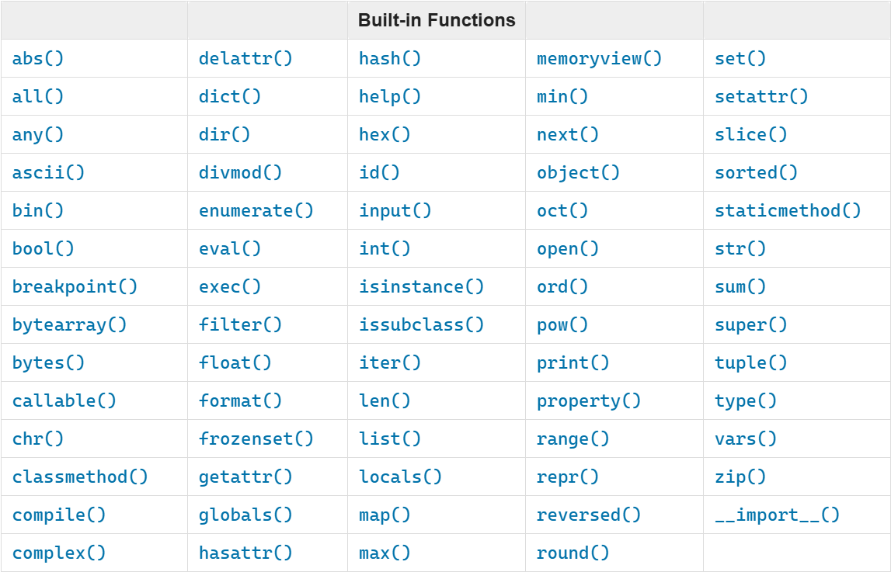
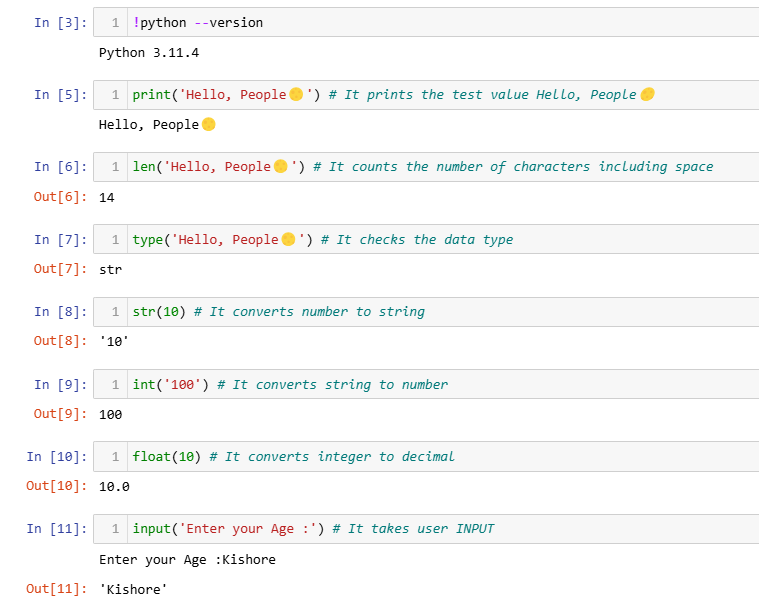
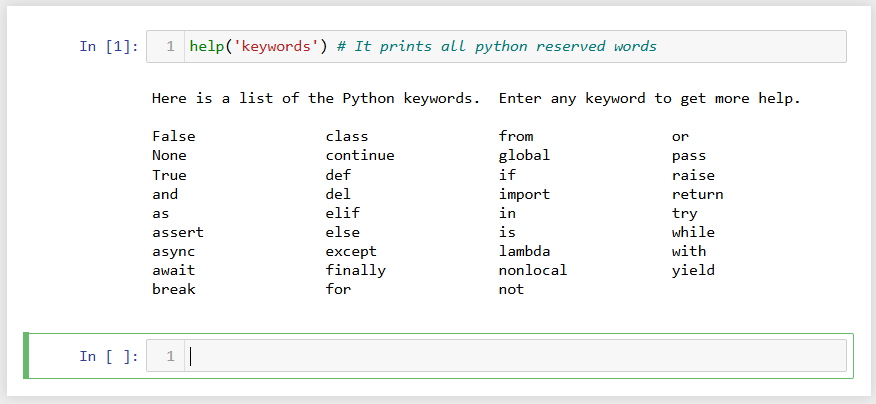
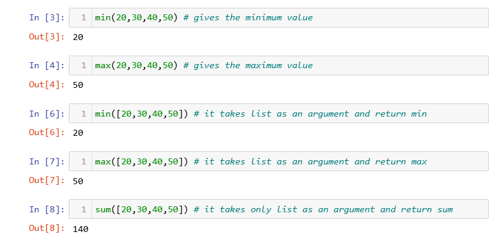

<div align="center">
  <h1>🐍 Python Learning 🐍</h1> 
</div>
  
<div align="center">
  🧡🧡🧡 HAPPY CODING 🧡🧡🧡
</div>


<div align="center">
  <h1> Python Learning : Day 2 - Variables, Builtin Functions</h1>
  <a class="header-badge" target="_blank" href="https://www.linkedin.com/in/msnkishore1702/">
  
  </a>


  <sub>Author :
  <a href="https://www.linkedin.com/in/msnkishore1702/" target="_blank">Sohatej Naga Kishore</a><br>
  <small> First Edition : October, 2024</small>
  </sub>
</div>


[<< Day 1](../readme.md) | [Day 3 >>](../03)


- [📘 Day 2](#-day-2)
  - [Built in functions](#built-in-functions)
  - [Variables](#variables)
    - [Creating Variables](#creating-variables)
    - [Assigning Multiple Variables in a Line](#assigning-multiple-variables-in-a-line)
  - [Data Types](#data-types)
  - [Checking Data types and Casting](#checking-data-types-and-casting)
  - [Numbers](#numbers)
  - [💻 Exercises - Day 2](#-exercises---day-2)
    - [Exercises: Level 1](#exercises-level-1)
    - [Exercises: Level 2](#exercises-level-2)


# 📘 Day 2

## Built in functions

In Python we have lots of built-in functions. Built-in functions are globally available for your use that mean you can make use of the built-in functions without importing or configuring. Some of the most commonly used Python built-in functions are the following: _print()_, _len()_, _type()_, _int()_, _float()_, _str()_, _input()_, _list()_, _dict()_, _min()_, _max()_, _sum()_, _sorted()_, _open()_, _file()_, _help()_, and _dir()_. In the following table you will see an exhaustive list of Python built-in functions taken from [python documentation](https://docs.python.org/3.9/library/functions.html).



Let us open the Python shell and start using some of the most common built-in functions. 
### From this point onward, I will be working with you in Jupyter Notebook for any Python development. Should you need instructions to install Jupyter Notebook on your PC, you can refer to this installation guide.
- For [Windows](https://youtu.be/bkOEYmyMtEU?si=zypl7ihyDSXmWwEG)
- For [Mac](https://youtu.be/drbaFALFKDg?si=_E1B9VPnAdUzQ7i_)

### Should you prefer to proceed with the Python Shell, you are welcome to do so.

Let us open the Jupyter Notebook and start using some of the most common built-in functions.



Let us practice more by using different built-in functions



As you can see from the terminal above, Python has got reserved words. We do not use reserved words to declare variables or functions.
We will cover variables in the next section.

I believe, by now you are familiar with built-in functions. Let us do one more practice of built-in functions and we will move on to the next section.



## Variables

Variables store data in a computer memory. Mnemonic variables are recommended to use in many programming languages. A mnemonic variable is a variable name that can be easily remembered and associated. A variable refers to a memory address in which data is stored.
Number at the beginning, special character, hyphen are not allowed when naming a variable. A variable can have a short name (like x, y, z), but a more descriptive name (firstname, lastname, age, country) is highly recommended.

Python Variable Name Rules

- A variable name must start with a letter or the underscore character
- A variable name cannot start with a number
- A variable name can only contain alpha-numeric characters and underscores (A-z, 0-9, and \_ )
- Variable names are case-sensitive (firstname, Firstname, FirstName and FIRSTNAME) are different variables)

Here are some example of valid variable names:

```shell
firstname
lastname
age
country
city
first_name
last_name
```

Invalid variables names

```shell
first-name
first@name
first$name
num-1
1num
```

## Creating Variables

Python has no command for declaring a variabel.
A variable is created the moment you first assign a value to it.

_Example:_

```py
x = 5
y = "John"
print(x)   # 5
print(y)   # John
```
Variable do not need to be declared with any particular type, and can even change type after they have been set.

```py
x = 4       # x is of type int
x = "Sally" # x is now of type str
print(x)

It gives the output : Sally
```

### Multiple Words Variable Names

Variable names with more than one word can be difficult to read.
There are several techniques you can use to make them more readable:

### Camel Case
Each word, except the first, starts with a capital letter:
```py
myVariableName = "Kishore"
```
### Pascal Case
Each word starts with a capital letter:
```py
myVariableName = "Kishore"
```
### Snake Case
Each word is separated by an underscore character:
```py
my_variable_name = "John"
```
## Assigning Multiple Variables in a Line
Python allows you to assign values to multiple variables in one line:
_*Examples:*_
```py
x, y, z = "Ronaldo CR7", "Messi", "Neymar"
print(x)
print(y)
print(z)
```
Output
```
Ronaldo CR7
Messi
Neymar
```

```py
first_name, last_name, country, age, is_married = 'Kishore', 'Mada', 'India', 100, False

print(first_name, last_name, country, age, is_married)
print('First name:', first_name)
print('Last name: ', last_name)
print('Country: ', country)
print('Age: ', age)
print('Married: ', is_married)
```
Output:
```
Kishore Mada India 100 False
First name: Kishore
Last name:  Mada
Country:  India
Age:  100
Married:  False
```
### One Value to Multiple Variables
And you can assign the same value to multiple variables in one line:
```py
x = y = z = "Sunil Chhetri"
print(x)
print(y)
print(z)
```
Output:
```
Sunil Chhetri
```
Getting user input using the input() built-in function. Let us assign the data we get from a user into first_name and age variables.

_Example:_
```py
first_name = input('What is your name: ')
age = int(input('How old are you? '))  # Convert age to an integer

print("Name:", first_name)
print("Age:", age)
```
Output:
```
What is your name: Kishore
How old are you? 22
Name: Kishore
Age: 22
```
## Data Types

Every value has a datatype, and variables can hold values. Python is a powerfully composed language; consequently, we don't have to characterize the sort of variable while announcing it. The interpreter binds the value implicitly to its type.
_Example :_
```py
x = "Hello World"         #	str	
x = 20	                  # int	
x = 20.5	                # float	
x = 1j                    #	complex
x = range(6)	            # range	
x = True	                # bool	
x = b"Hello"	            # bytes
x = True	                # bool	
x = b"Hello"	            # bytes
x = bytearray(5)	        # bytearray
x = memoryview(bytes(5))	# memoryview	
x = ["apple", "banana", "cherry"]      # list	
x = ("apple", "banana", "cherry")      # tuple	
x = {"name" : "John", "age" : 36}	     # dict	
x = {"apple", "banana", "cherry"}      # set	
x = frozenset({"apple", "banana", "cherry"})  # frozenset	
```
## Checking Data types and Casting
- Check Data types: To check the data type of certain data/variable we use the type
_Examples:_

```py
# Different python data types
# Let's declare variables with various data types

first_name = 'Kishore'     # str
last_name = 'M'            # str
country = 'India'          # str
age = 100                  # int

# Printing out types
print(type('Kishore'))           # str
print(type(first_name))          # str
print(type(10))                  # int
print(type(3.14))                # float
print(type(1 + 1j))              # complex
print(type(True))                # bool
print(type([1, 2, 3, 4]))        # list
print(type({'name':'Kishore'}))  # dict
print(type((1,2)))               # tuple
print(type(zip([1,2],[3,4])))    # zip
```
## Casting
Converting one data type to another data type. We use int(), float(), str(), list, set When we do arithmetic operations string numbers should be first converted to int or float otherwise it will return an error. If we concatenate a number with a string, the number should be first converted to a string. We will talk about concatenation in String section.

_Examples :_

```py
# int to float
num_int = 10
print('num_int',num_int)         # 10
num_float = float(num_int)
print('num_float:', num_float)   # 10.0

# float to int
gravity = 9.81
print(int(gravity))             # 9

# int to str
num_int = 10
print(num_int)                  # 10
num_str = str(num_int)
print(num_str)                  # '10'

# str to int or float
num_str = '10.6'
num_float = float(num_str)
print('num_float', float(num_str))  # 10.6
num_int = int(num_float)
print('num_int', int(num_int))      # 10

# str to list
first_name = 'Kishore'
print(first_name)               # 'Kishore'
first_name_to_list = list(first_name)
print(first_name_to_list)            # ['K', 'i', 's', 'h', 'o', 'r', 'e']
```

## Numbers
Number data types in Python:

1.Integers: Integer(negative, zero and positive) numbers:
    Example: ... -3, -2, -1, 0, 1, 2, 3 ...

2.Floating Point Numbers(Decimal numbers) 
    Example: ... -3.5, -2.25, -1.0, 0.0, 1.1, 2.2, 3.5 ...

3.Complex Numbers 
    Example: 1 + j, 2 + 4j, 1 - 1j

🌕 You are awesome. You have just completed day 2 Learning and you are two steps ahead on your way to greatness. Now do some exercises for your brain and muscles.

## 💻 Exercises - Day 2

### Exercises: Level 1

1. Inside Python_Tuturials create a folder called day_2. Inside this folder create a file named variables.py
2. Write a python comment saying 'Day 2: python programming'
3. Declare a first name variable and assign a value to it
4. Declare a last name variable and assign a value to it
5. Declare a full name variable and assign a value to it
6. Declare a country variable and assign a value to it
7. Declare a city variable and assign a value to it
8. Declare an age variable and assign a value to it
9. Declare a year variable and assign a value to it
10. Declare a variable is_married and assign a value to it
11. Declare a variable is_true and assign a value to it
12. Declare a variable is_light_on and assign a value to it
13. Declare multiple variable on one line

### Exercises: Level 2

1. Check the data type of all your variables using type() built-in function
1. Using the _len()_ built-in function, find the length of your first name
1. Compare the length of your first name and your last name
1. Declare 5 as num_one and 4 as num_two
1. Add num_one and num_two and assign the value to a variable total
1. Subtract num_two from num_one and assign the value to a variable diff
1. Multiply num_two and num_one and assign the value to a variable product
1. Divide num_one by num_two and assign the value to a variable division
1. Use modulus division to find num_two divided by num_one and assign the value to a variable remainder
1. Calculate num_one to the power of num_two and assign the value to a variable exp
1. Find floor division of num_one by num_two and assign the value to a variable floor_division
1. The radius of a circle is 30 meters.
    1. Calculate the area of a circle and assign the value to a variable name of _area_of_circle_
    2. Calculate the circumference of a circle and assign the value to a variable name of _circum_of_circle_
    3. Take radius as user input and calculate the area.
1. Use the built-in input function to get first name, last name, country and age from a user and store the value to their corresponding variable names
1. Run help('keywords') in Python shell or in your file to check for the Python reserved words or keywords

🎉 CONGRATULATIONS ! 🎉

[<< Day 1](../readme.md) | [Day 3 >>](../03)


