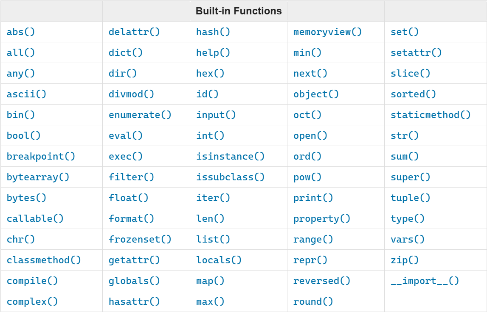

  <h1>🐍 Python Learning 🐍</h1> 

  

  🧡🧡🧡 HAPPY CODING 🧡🧡🧡

  <h1> Python Learning : Day 2 - Variables, Builtin Functions</h1>
  

  Author :
  <a href="https://www.linkedin.com/in/msnkishore1702/" target="_blank">Sohatej Naga Kishore</a> 
  <small> First Edition : October, 2024</small>
  

[<< Day 1](../readme.md) | [Day 3 >>](../03)

- [📘 Day 2](#-day-2)
  - [Built in functions](#built-in-functions)

# 📘 Day 2

## Built in functions

In Python we have lots of built-in functions. Built-in functions are globally available for your use that mean you can make use of the built-in functions without importing or configuring. Some of the most commonly used Python built-in functions are the following: _print()_, _len()_, _type()_, _int()_, _float()_, _str()_, _input()_, _list()_, _dict()_, _min()_, _max()_, _sum()_, _sorted()_, _open()_, _file()_, _help()_, and _dir()_. In the following table you will see an exhaustive list of Python built-in functions taken from [python documentation](https://docs.python.org/3.9/library/functions.html).

Let us open the Python shell and start using some of the most common built-in functions. 
### From this point onward, I will be working with you in Jupyter Notebook for any Python development. Should you need instructions to install Jupyter Notebook on your PC, you can refer to this installation guide.
- For [Windows](https://youtu.be/bkOEYmyMtEU?si=zypl7ihyDSXmWwEG)
- For [Mac](https://youtu.be/drbaFALFKDg?si=_E1B9VPnAdUzQ7i_)

### Should you prefer to proceed with the Python Shell, you are welcome to do so.

LeLet us open the Jupyter Notebook and start using some of the most common built-in functions.

