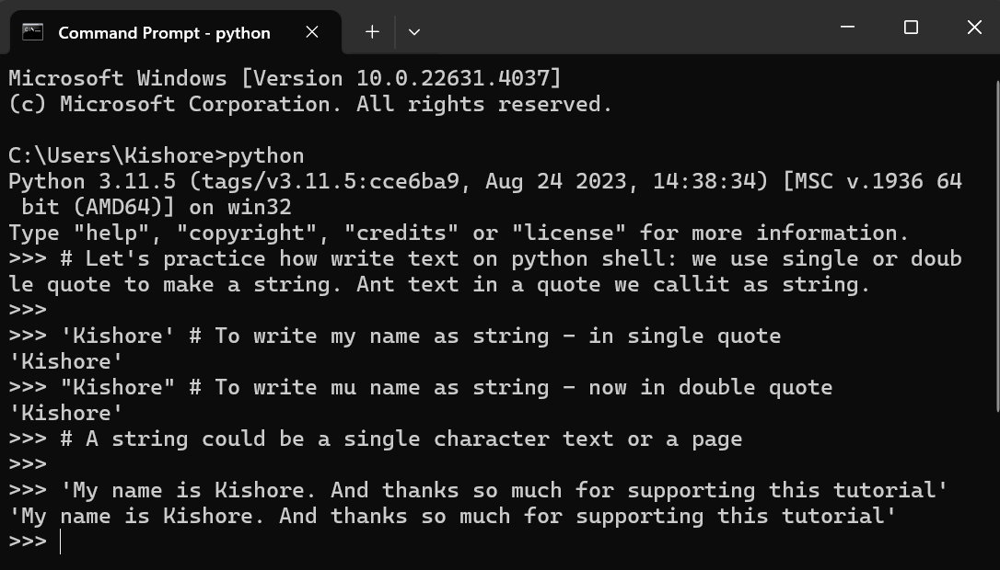
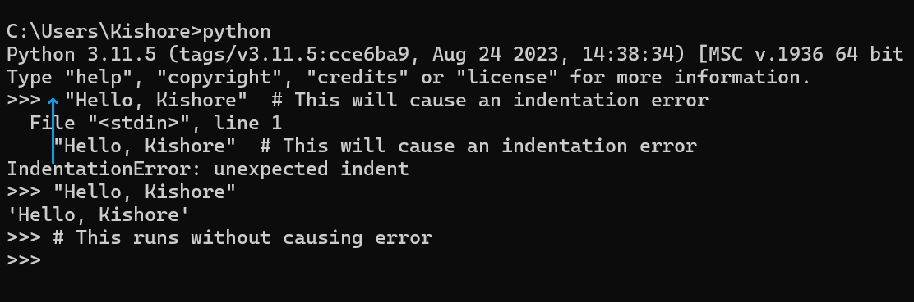
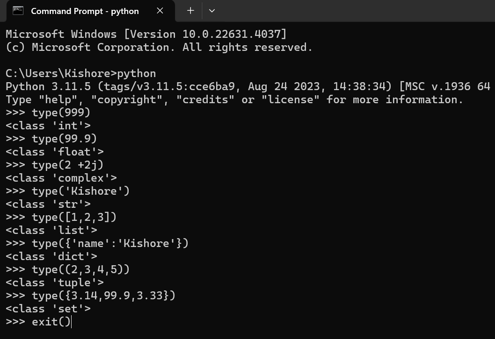

<div align="center">
  <h1>🐍 Python Learning 🐍</h1> 
</div>
  
<div align="center">
  🧡🧡🧡 HAPPY CODING 🧡🧡🧡
</div>


<div align="center">
  <h1> Python Learning : Day 1 - Introduction</h1>
  <a class="header-badge" target="_blank" href="https://www.linkedin.com/in/msnkishore1702/">
  
  </a>


  <sub>Author :
  <a href="https://www.linkedin.com/in/msnkishore1702/" target="_blank">Sohatej Naga Kishore</a><br>
  <small> First Edition : October, 2024</small>
  </sub>
</div>


[Day 2 >>](./02_Day_Variables_Builtin_Functions/02_variables_builtin_functions.md)


- [🐍 Python Learning](#-python_tutorials)
- [📘 Day 1](#-day-1)
  - [Introduction](#introduction)
  - [What is Python ?](#what-is-python-)
  - [Environment Setup](#environment-setup)
    - [Installing Python](#installing-python)
    - [Python Shell](#python-shell)
  - [Basic Python](#basic-python)
    - [Python Syntax](#python-syntax)
    - [Python Indentation](#python-indentation)
    - [Comments](#comments)
    - [Data types](#data-types)
      - [Number](#number)
      - [String](#string)
      - [Booleans](#booleans)
      - [List](#list)
      - [Dictionary](#dictionary)
      - [Tuple](#tuple)
      - [Set](#set)
    - [Checking Data types](#checking-data-types)
    - [Python File](#python-file)
  - [💻 Exercises - Day 1](#-exercises---day-1)
    - [Exercise: Level 1](#exercise-level-1)
    - [Exercise: Level 2](#exercise-level-2)
    - [Exercise: Level 3](#exercise-level-3)

# 📘 Day 1

## Introduction

Python is a high-level programming language for general-purpose programming. It is an open source, interpreted, objected-oriented programming language. Python was created by a Dutch programmer, Guido van Rossum. The name of the Python programming language was derived from a British sketch comedy series, *Monty Python's Flying Circus*.  The first version was released on February 20, 1991. 

Python is widely used in various fields, such as web development, data science, artificial intelligence, automation, and software development. Its extensive standard library and vast range of external packages enable developers to build robust applications quickly across platforms like Windows, Mac, and Linux.

This tutorial is designed for beginners and professionals who want to learn python programming language. It may take 30 to 100 days to complete the challenge. 

This tutorial is easy to read, written in conversational English, engaging, motivating and at the same time, it is very demanding. You need to allocate much time to finish this challenge. If you are a visual learner, you may get the video lesson on <a href="https://www.youtube.com/channel/UC7PNRuno1rzYPb1xLa4yktw"> Washera</a> YouTube channel. You may start from [Python for Absolute Beginners video](https://youtu.be/OCCWZheOesI). 

## What is Python ?

Python is a popular programming language. It was created by Guido van Rossum, and released in 1991.

It is used for:
- Web development (server-side),
- Software development,
- Mathematics,
- System Scripting.

## What can Python do ?

- Python can be used on a server to create web applications.
- Python can be used alongside software to create workflows.
- Python can connect to database systems. It can also read and modify files.
- Python can be used to handle big data and perform complex mathematics.
- Python can be used for rapid prototyping, or for production-ready software development.

## Why Python ?

- Python works on multiple platforms, like Windows, Mac, Linux, and Raspberry Pi.
- It has a simple, English-like syntax that’s easy to read and write.
- Developers can write programs with fewer lines compared to other languages.
- Python runs on an interpreter, allowing code to be tested immediately, which is helpful for quick prototyping.
- It supports different programming styles: procedural, object-oriented, and functional.

## Environment Setup

### Installing Python

To run a python script you need to install python. Let's [download](https://www.python.org/) python.
If your are a windows user. Click the button encircled in red.

[](https://www.python.org/)

If you are a macOS user. Click the button encircled in red.

[](https://www.python.org/)

To check if python is installed write the following command on your device terminal.

```shell
python --version
```


As you can see from the terminal, I am using _Python 3.7.5_ version at the moment. Your version of Python might be different from mine by but it should be 3.6 or above. If you mange to see the python version, well done. Python has been installed on your machine. Continue to the next section.

### Python Shell

Python is an interpreted scripting language, so it does not need to be compiled. It means it executes the code line by line. Python comes with a _Python Shell (Python Interactive Shell)_. It is used to execute a single python command and get the result.

Python Shell waits for the Python code from the user. When you enter the code, it interprets the code and shows the result in the next line.
Open your terminal or command prompt(cmd) and write:

```shell
python
```


The Python interactive shell is opened and it is waiting for you to write Python code(Python script). You will write your Python script next to this symbol >>> and then click Enter.
Let us write our very first script on the Python scripting shell.


Well done, you wrote your first Python script on Python interactive shell. How do we close the Python interactive shell ?
To close the shell, next to this symbol >> write **exit()** command and press Enter.


Now, you know how to open the Python interactive shell and how to exit from it.

Python will give you results if you write scripts that Python understands, if not it returns errors. Let's make a deliberate mistake and see what Python will return.


As you can see from the returned error, Python is so clever that it knows the mistake we made and which was _Syntax Error: invalid syntax_. Using x as multiplication in Python is a syntax error because (x) is not a valid syntax in Python. Instead of (**x**) we use asterisk (*) for multiplication. The returned error clearly shows what to fix.

The process of identifying and removing errors from a program is called _debugging_. Let us debug it by putting * in place of **x**.


Our bug was fixed, the code ran and we got a result we were expecting. As a programmer you will see such kind of errors on daily basis. It is good to know how to debug. To be good at debugging you should understand what kind of errors you are facing. Some of the Python errors you may encounter are _SyntaxError_, _IndexError_, _NameError_, _ModuleNotFoundError_, _KeyError_, _ImportError_, _AttributeError_, _TypeError_, _ValueError_, _ZeroDivisionError_ etc. We will see more about different Python **_error types_** in later sections.

Let us practice more how to use Python interactive shell. Go to your terminal or command prompt and write the word **python**.


The Python interactive shell is opened. Let us do some basic mathematical operations (addition, subtraction, multiplication, division, modulus,  exponential).

Let us do some maths first before we write any Python code:

- 3 + 3 is 6
- 4 - 2 is 2
- 4 * 2 is 8
- 5 / 2 is 2.5
- 4 ** 2 is the same as 4 * 4

In python we have the following additional operations:

- 3 % 2 = 1 => which means finding the remainder
- 3 // 2 = 1 => which means removing the remainder

Let us change the above mathematical expressions to Python code. The Python shell has been opened and let us write a comment at the very beginning of the shell.

A _comment_ is a part of the code which is not executed by python. So we can leave some text in our code to make our code more readable. Python does not run the comment part. A comment in python starts with hash(#) symbol.
This is how you write a comment in python

```shell
 # comment starts with hash
 # this is a python comment, because it starts with a (#) symbol
```


Before we move on to the next section, let us practice more on the Python interactive shell. Close the opened shell by writing _exit()_ on the shell and open it again and let us practice how to write text on the Python shell.



## Basic Python

### Python Syntax

A Python script can be written in Python interactive shell or in the code editor. A Python file has an extension .py.

### Python Indentation

An indentation is a white space in a text. Indentation in many languages is used to increase code readability; however, Python uses indentation to create blocks of code. In other programming languages, curly brackets are used to create code blocks instead of indentation. One of the common bugs when writing Python code is incorrect indentation.



### Comments

Comments play a crucial role in enhancing code readability and allowing developers to leave notes within their code. In Python, any text preceded by a hash (#) symbol is considered a comment and is not executed when the code runs.

**Example: Single Line Comment**

```shell
    # This is the first comment
    # This is the second comment
    # Python is eating the world
```

**Example: Multiline Comment**

Triple quote can be used for multiline comment if it is not assigned to a variable

```shell
"""This is multiline comment
multiline comment takes multiple lines.
python is eating the world
"""
```

### Data types

In Python there are several types of data types. Let us get started with the most common ones. Different data types will be covered in detail in other sections. For the time being, let us just go through the different data types and get familiar with them. You do not have to have a clear understanding now.

#### Number

- Integer: Integer(negative, zero and positive) numbers
    Example:
    ... -3, -2, -1, 0, 1, 2, 3 ...
- Float: Decimal number
    Example
    ... -3.5, -2.25, -1.0, 0.0, 1.1, 2.2, 3.5 ...
- Complex
    Example
    1 + j, 2 + 4j

#### String

A collection of one or more characters under a single or double quote. If a string is more than one sentence then we use a triple quote.

**Example:**

```py
'Kishore'
'Sohatej'
'Python'
'I love anime'
'I hope you are enjoying the first day of Python Tutorial'
```

#### Booleans

A boolean data type is either a True or False value. T and F should be always uppercase.

**Example:**

```python
    True  #  Is the light on? If it is on, then the value is True
    False #  Is the light on? If it is off, then the value is False
```

#### List

Python list is an ordered collection which allows to store different data type items. A list is similar to an array in JavaScript.

**Example:**

```py
[0, 1, 2, 3, 4, 5]  # all are the same data types - a list of numbers
['Banana', 'Orange', 'Mango', 'Guava'] # all the same data types - a list of strings (fruits)
['India','America', 'Australia','Japan'] # all the same data types - a list of strings (countries)
['Mango', 30, True, 9.99] # different data types in the list - string, integer, boolean and float
```

#### Dictionary

A Python dictionary object is an unordered collection of data in a key value pair format.

**Example:**

```py
{
'first_name':'Sohatej Naga Kishore',
'last_name':'Mada',
'country':'India', 
'age':22, 
'is_married':False,
'skills':['Python', 'HTML', 'React Native', 'UI/UX']
}
```

#### Tuple

A tuple is an ordered collection of different data types like list but tuples can not be modified once they are created. They are immutable.

**Example:**

```py
('Kishore', 'Pavan', 'Ash', 'SonGoku', 'Naruto') # Names
```

```py
('Earth', 'Jupiter', 'Neptune', 'Mars', 'Venus', 'Saturn', 'Uranus', 'Mercury') # planets
```

#### Set

A set is a collection of data types similar to list and tuple. Unlike list and tuple, set is not an ordered collection of items. Like in Mathematics, set in Python stores only unique items.

In later sections, we will go in detail about each and every Python data type.

**Example:**

```py
{2, 4, 3, 5, 1}
{3.14, 9.81, 2.7} # order is not important in set
```

### Checking Data types

To check the data type of certain data/variable we use the **type** function. In the following terminal you will see different python data types:



### Python File

First open your project folder, Python_Tutorials. If you don't have this folder, create a folder name called Python_Tutorials. Inside this folder, create a file called Basic.py. Now, let's do what we did on python interactive shell using visual studio code.

The Python interactive shell was printing without using **print** but on visual studio code to see our result we should use a built in function _print(). The _print()_ built-in function takes one or more arguments as follows _print('arument1', 'argument2', 'argument3')_. See the examples below.

**Example:**

The file name is helloworld.py

```py
# Day 1 - Python Tutorial

print(2 + 3)             # addition(+)
print(3 - 1)             # subtraction(-)
print(2 * 3)             # multiplication(*)
print(3 / 2)             # division(/)
print(3 ** 2)            # exponential(**)
print(3 % 2)             # modulus(%)
print(3 // 2)            # Floor division operator(//)

# Checking data types
print(type(10))          # Int
print(type(3.14))        # Float
print(type(1 + 3j))      # Complex number
print(type('Kishore'))  # String
print(type([1, 2, 3]))   # List
print(type({'name':'Kishore'})) # Dictionary
print(type({9.8, 3.14, 2.7}))    # Set
print(type((9.8, 3.14, 2.7)))    # Tuple
```


🌕  You are amazing. You have just completed day 1 Learning and you are on your way to greatness. Now do some exercises for your brain and muscles.

## 💻 Exercises - Day 1

### Exercise: Level 1

1. Check the python version you are using
2. Open the python interactive shell and do the following operations. The operands are 3 and 4.
   - addition(+)
   - subtraction(-)
   - multiplication(\*)
   - modulus(%)
   - division(/)
   - exponential(\*\*)
   - floor division operator(//)
3. Write strings on the python interactive shell. The strings are the following:
   - Your name
   - Your family name
   - Your country
   - I am enjoying 30 days of python
4. Check the data types of the following data:
   - 10
   - 9.8
   - 3.14
   - 4 - 4j
   - ['Kishore', 'Python', 'India']
   - Your name
   - Your family name
   - Your country

### Exercise: Level 2

1. Create a folder named day_1 inside Python_Tutorials folder. Inside day_1 folder, create a python file Basic.py and repeat questions 1, 2, 3 and 4. Remember to use _print()_ when you are working on a python file. Navigate to the directory where you have saved your file, and run it.

### Exercise: Level 3

1. Write an example for different Python data types such as Number(Integer, Float, Complex), String, Boolean, List, Tuple, Set and Dictionary.
2. Find an [Euclidian distance](https://en.wikipedia.org/wiki/Euclidean_distance#:~:text=In%20mathematics%2C%20the%20Euclidean%20distance,being%20called%20the%20Pythagorean%20distance.) between (5, 6) and (12, 10)

🎉 CONGRATULATIONS ! 🎉

[Day 2 >>](./02)
